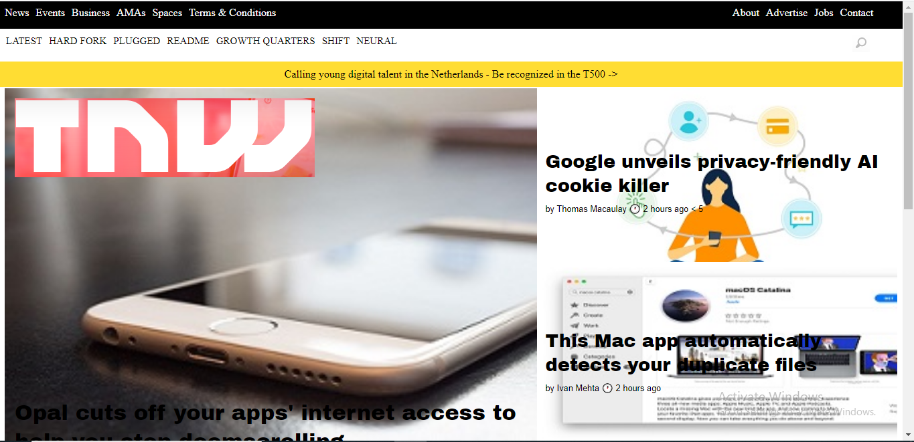

# Main Responsive Web Design

> A project prepared in submission to Microverse

Additional description about the project and its features.

## Built With

- HTML5
- CSS3 for Responsiveness

## Live Demo

[Live Demo Link](https://tedlivist.github.io/main-rwd/)

## Authors

👤 **Author1**

- [Github](https://github.com/TedLivist)
- [LinkedIn](https://linkedin.com/in/tememandu)

👤 **Author2**

- [Github](https://github.com/vikitaotiz)
- [LinkedIn](https://www.linkedin.com/in/victor-otieno-22ba7773/)

## 🤝 Contributing

Contributions, issues, and feature requests are welcome!

Feel free to check the [issues page](../../issues/).

## Show your support

Give a ⭐️ if you like this project!

## Acknowledgments

- Hat tip to anyone whose code was used
- Microverse
- w3schools